# VisionGuard: Advanced Ocular Disease Detection System  

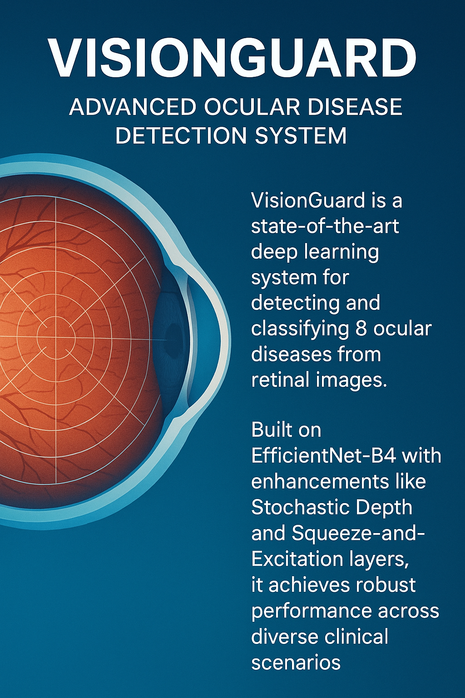  

**VisionGuard** is a state-of-the-art deep learning system for detecting and classifying 8 ocular diseases from retinal images. Built on EfficientNet-B4 with enhancements like Stochastic Depth and Squeeze-and-Excitation layers, it achieves robust performance across diverse clinical scenarios. 

---

## 💾 DataSet
 -**Structured ophthalmic database**: It comprises data from 5,000 patients.
 -**Data included**: The dataset contains patient's age, color fundus photographs from both eyes (left and right), and doctors'  diagnostic keywords.
 -**Image capture**: Fundus images were taken using different cameras (Canon, Zeiss, and Kowa), leading to varying image resolutions.
-**Classification**: Patients are classified into eight categories: Normal (N), Diabetes (D), Glaucoma (G), Cataract (C), Age-related Macular Degeneration (A), Hypertension (H), Pathological Myopia (M), and Other diseases/abnormalities (O).   


---

## 🌟 Key Features  
- **Multi-Disease Detection**: Classifies **8 conditions**:  
  `Normal (N)`, `Diabetes (D)`, `Glaucoma (G)`, `Cataract (C)`,  
  `Macular Degeneration (A)`, `Hypertension (H)`, `Pathological Myopia (M)`,  
  `Other abnormalities (O)`.  
- **Efficient Architecture**: Optimized with MBConv blocks for reduced computational cost.  
- **Stochastic Depth**: Reduces overfitting via random layer dropout during training.  
- **Interpretable Results**: Confusion matrices, F1-scores, and ROC curves included.  

---

## 📊 Performance Summary  
**Overall Metrics**:  
- **Micro F1-score**: 0.7727  
- **Macro F1-score**: 0.7173  
- **Hamming Loss**: 0.0613  
- **Average Precision**: 0.7529  

**Disease-Specific Metrics**:  

| Category              | Accuracy   | F1-Score | Recall   | Precision |  
|-----------------------|------------|----------|----------|-----------|  
| **Normal (N)**        | 90.38%     | 0.8457   | 0.8024   | 0.8939    |  
| **Diabetes (D)**      | 86.23%     | 0.7464   | 0.6411   | 0.8931    |
| **Cataract (C)**      | **99.29%** | 0.9419   | 0.9241   | 0.9605    |  
| **Glaucoma (G)**      | 98.04%     | 0.8148   | 0.7639   | 0.8730    |  
| **Hypertension (H)**  | 96.95%     | 0.0000   | 0.0000   | NaN*      | 
|**Age related(A)**     | 97.57%     | 0.7634   | 0.7463   | 0.7812    |
|**Myopia (M)**         | 99.45%     | 0.9440   | 0.9077   | 0.9833    |
|**Other diseases (O)** |83.02%      | 0.6823   | 0.7327   | 0.6384    |


_*Precision for Hypertension is NaN due to zero true positives,zero false positives.   

---

## 🛠️ Model Architecture  
### 1. **Backbone Network**  
- **EfficientNet-B4**: Extracts hierarchical features using:  
  - MBConv blocks with channel expansion ratios.  
  - Squeeze-and-Excitation (SE) layers for adaptive channel-wise feature recalibration.  
  - Stochastic Depth (`p=0.0` to `0.1875`) for regularization.  

### 2. **Meta Network**  
- Processes metadata (optional) via a 2-layer MLP with dropout (`p=0.3`).  

### 3. **Classifier**  
- Fully connected layers (`2576 → 512 → 8`) with ReLU and dropout (`p=0.5`).  

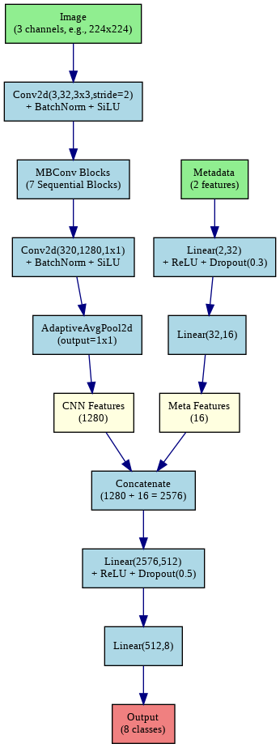  

---

**README.md** (Revised Installation & Interface Sections)  

---

## 🚀 Installation  

### 1. **Clone the Repository**  
First, copy the project to your local machine using:  
```bash  
git clone https://github.com/Vnadh/VisionGuard.git  
cd VisionGuard  # Navigate to the project folder  
```  

---

### 2. **Install Dependencies**  
Install all required Python libraries using:  
```bash  
pip install -r requirements.txt  
```  
> 🔍 **What this does**: This installs PyTorch, Streamlit, and other packages listed in `requirements.txt`.  

---

### 3. **Launch the Web Interface**  
Start the user-friendly medical interface with one command:  
```bash  
streamlit run app.py  
```  
✅ **What to expect**:  
- A browser window will open automatically at `http://localhost:8501`.  
- Upload a retinal image and click **predict** to get instant predictions.  
- See example results below:  

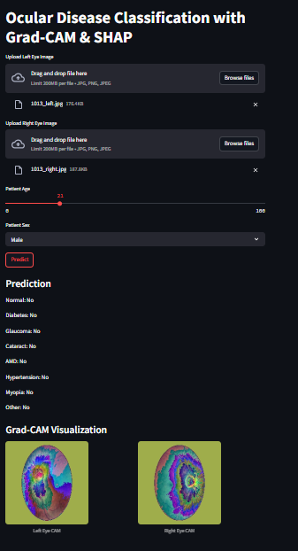  

---

### 🚨 Troubleshooting Tips  
- **Dependency errors**: Run `pip install --upgrade -r requirements.txt`.  
- **Port conflicts**: Use `streamlit run app.py --server.port 8502` to switch ports.  
- **Slow performance**: Ensure you’re using a GPU-enabled environment for faster inference.  

     


---
### 📈 Results Visualization
**confusion matrixfor Normal (N)**:
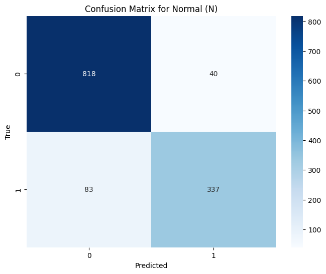 <br>
**Confusion Matrix for Diabetes (D)**:
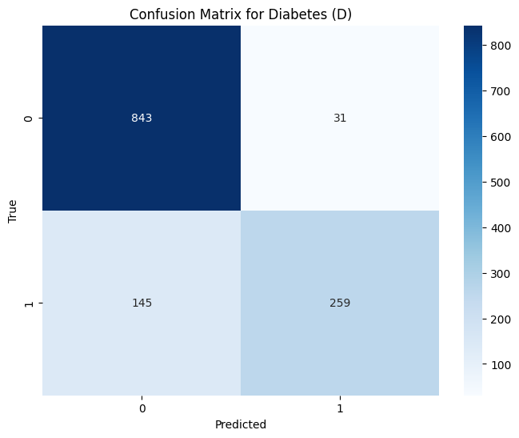 <br>
**Confusion Matrix for Glaucoma (G)**:
 <br>
**Confusion Matrix for Cataract (C)**:
 <br>
**Confusion Matrix for Age related Macular Degeneration (A)**:
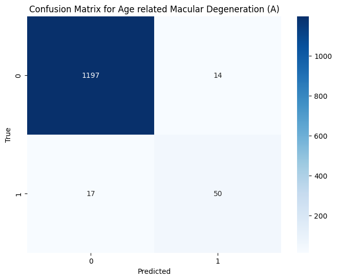 <br>
**Confusion Matrix for Hypertension (H)**:
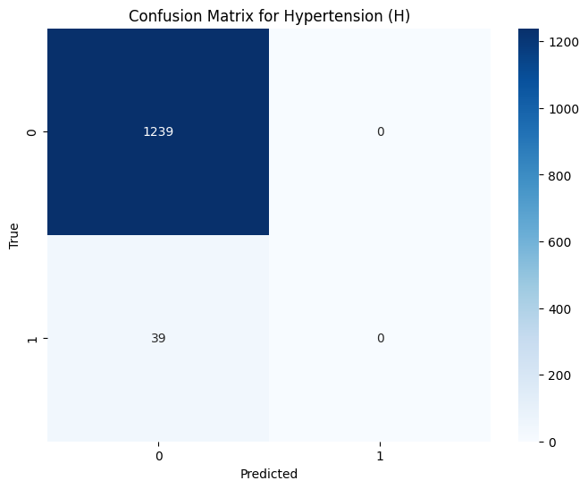 <br>
**Confusion Matrix for Pathological Myopia (M)**:
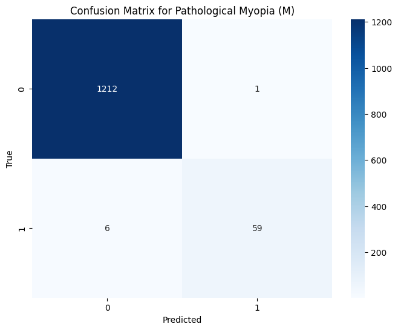 <br>
**Confusion Matrix for Other diseases/abnormalities (O)**:
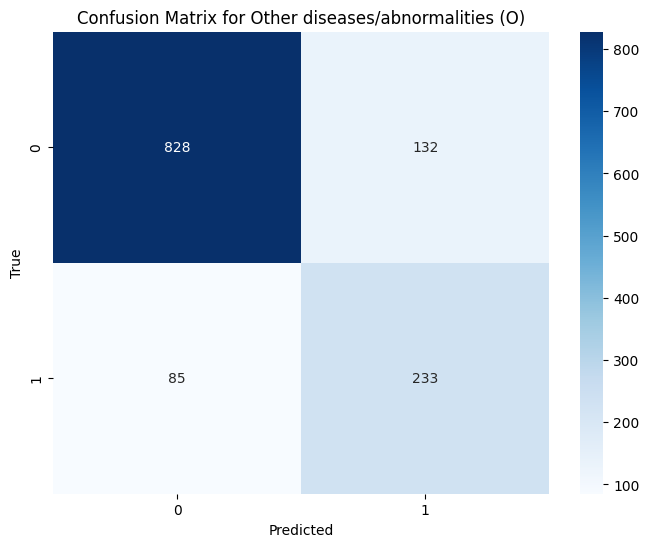<br>
**Bar Graph of Accuracy Scores for Different Diseases**:
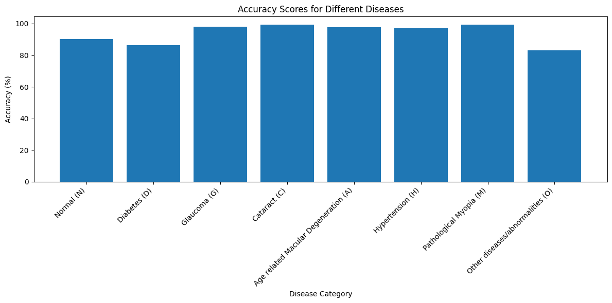 <br>
**Receiver Operating Characteristic (ROC) Curves**:
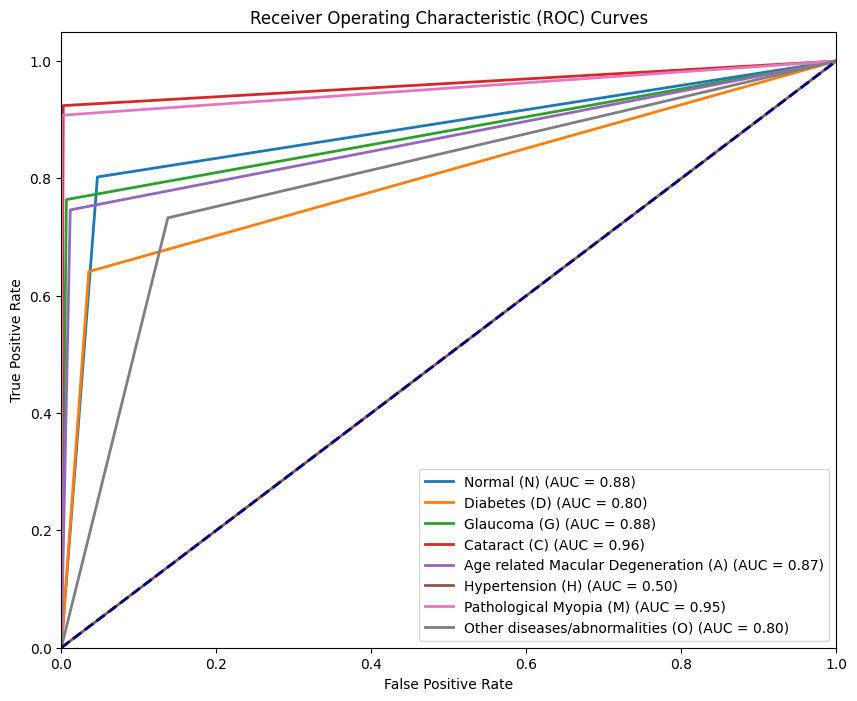 <br>
---
### 🤝 Contributing
 Contributions are welcome! Open an issue or submit a pull request for improvements.
---
### 📜 License
 MIT License. See LICENSE for details.
---
### 🌐 Website
 Explore a live prediction demo at [visionguard-vnadh.streamlit.app](https://visionguard-vnadh.streamlit.app/) .
---
### 🚧 Limitations & Future Work
 * Hypertension Detection: Fails due to class imbalance (no true positives).
   * Fix: Apply oversampling or synthetic data generation (e.g., SMOTE).

 * Hardware Requirements: EfficientNet-B4 demands significant GPU memory.
  * Fix: Use mixed-precision training or switch to EfficientNet-B2.
